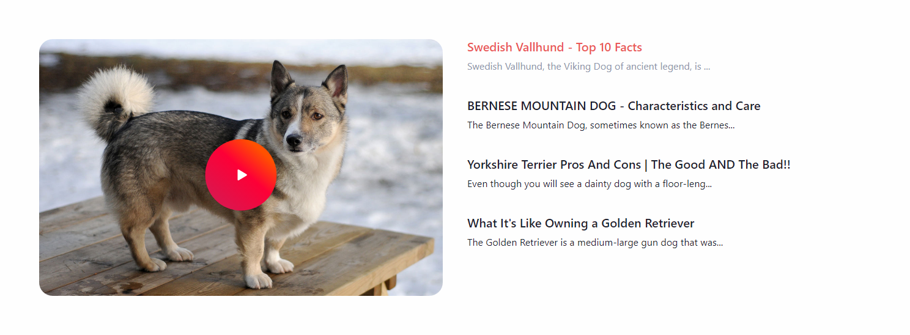

# clearmix-jam-session

- [Nest API](./api/)

- [Next App](./next/)

## Instructions for running the project

- I'm using npx on my machine and running node version `16.5.0`, npm version `7.19.1`

- I've excluded the node_modules folders to keep the zip file small

- I ran the applications using the package.json scripts `npm run start:dev` + `npm run dev`

- The Nest API should be hosted on `http://localhost:3001/api`

- The Next app should be hosted on `http://localhost:3000/`
